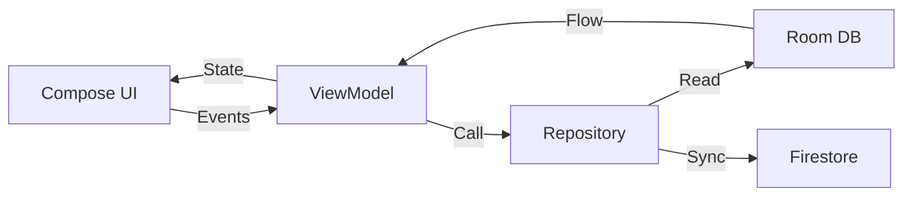

# SubScout - Subscription Management App 📱💸

**SubScout** is a modern Android application designed to help users track their recurring subscriptions, monitor monthly expenses, and avoid "subscription fatigue". Built with **Kotlin** and **Jetpack Compose**, it features an offline-first architecture synchronized with **Firebase**.

## ✨ Features

- ** Subscription Tracking**: Add, Edit, and Delete subscriptions (Netflix, Spotify, Gym, etc.).
- **💰 Budget Overview**: Real-time calculation of total monthly expenses.
- **🔌 Offline-First**: Works completely without internet using a local **Room Database**. Syncs to cloud when online.
- **🎨 Smart Logos**: Automatic local logo detection for popular services (Netflix, Prime, Disney+, etc.).
- **🔐 User & Admin Roles**:
  - **Users**: Manage personal subscriptions.
  - **Admins**: Dedicated dashboard to view user statistics and data.
- **🌍 Internationalization**: Fully translated into **English**, **French**, and **Spanish** with in-app switching.

## 🛠️ Tech Stack

- **Language**: Kotlin 2.0+
- **UI**: [Jetpack Compose](https://developer.android.com/jetpack/compose) (Material Design 3)
- **Architecture**: MVVM (Model-View-ViewModel) + Repository Pattern
- **Dependency Injection**: [Hilt](https://dagger.dev/hilt/)
- **Local Database**: [Room](https://developer.android.com/training/data-storage/room) (SQLite)
- **Cloud Backend**:
  - **Firebase Auth**: Email/Password Authentication
  - **Firebase Firestore**: NoSQL Database for remote sync
- **Navigation**: Navigation Compose
- **Images**: Custom Vector Assets (optimized for performance)

## 🚀 Setup & Installation

1.  **Clone the repository**:
    ```bash
    git clone https://github.com/your-username/SubScout.git
    ```
2.  **Firebase Configuration** (Critical):
    *   This project requires a `google-services.json` file.
    *   Create a project in the [Firebase Console](https://console.firebase.google.com/).
    *   Enable **Authentication** (Email/Password).
    *   Enable **Firestore Database**.
    *   Download `google-services.json` and place it in the `app/` folder.
3.  **Build**:
    *   Open the project in Android Studio (Ladybug or newer recommended).
    *   Sync Gradle files.
    *   Run on an Emulator or Physical Device (Min SDK 24).

## 🏗️ Architecture

The app follows the **Unidirectional Data Flow (UDF)** principle:



## 📸 Screenshots

| Home Screen | Add Subscription | Admin Dashboard |
|:-----------:|:----------------:|:---------------:|
| *(Add Image)* | *(Add Image)* | *(Add Image)* |

## 👥 Contributors

*   **Matis Bader** - *Mobile Development Student*
*   **Alice De Vallombreuse** - *Mobile Development Student*

---
*Project created for the "Mobile Development in Android" course (2025-2026).*
